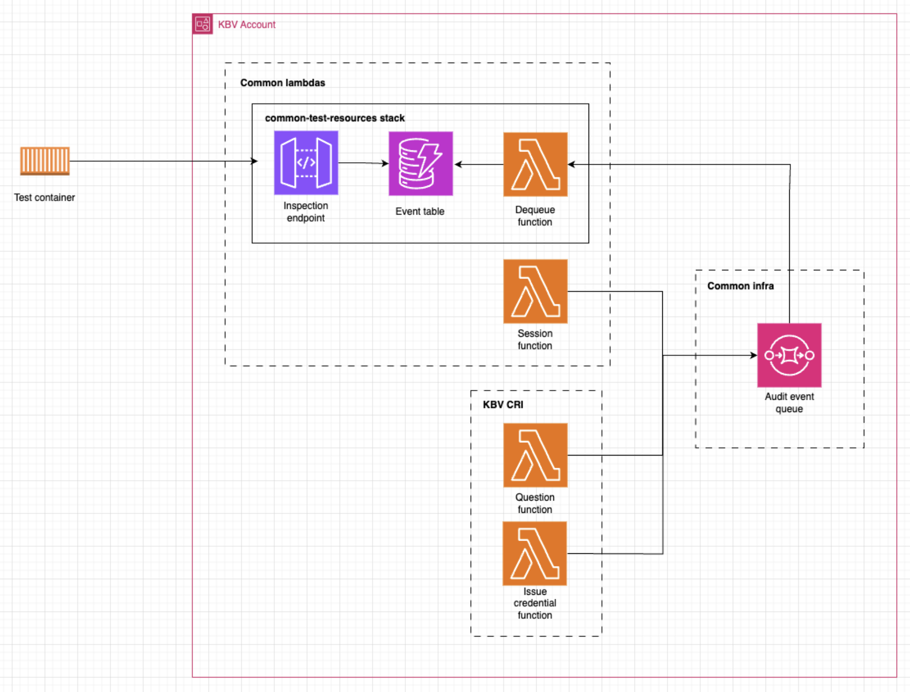

# Test Harness

This is a test harness that listens to events from the TxMA SQS queue and puts them a test events table which can then be accessed using an API to allow automated testing of TxMA events.

This should only be used in dev and build environments

## How to use

## Architecture

Architecture diagram in an example CRI account

