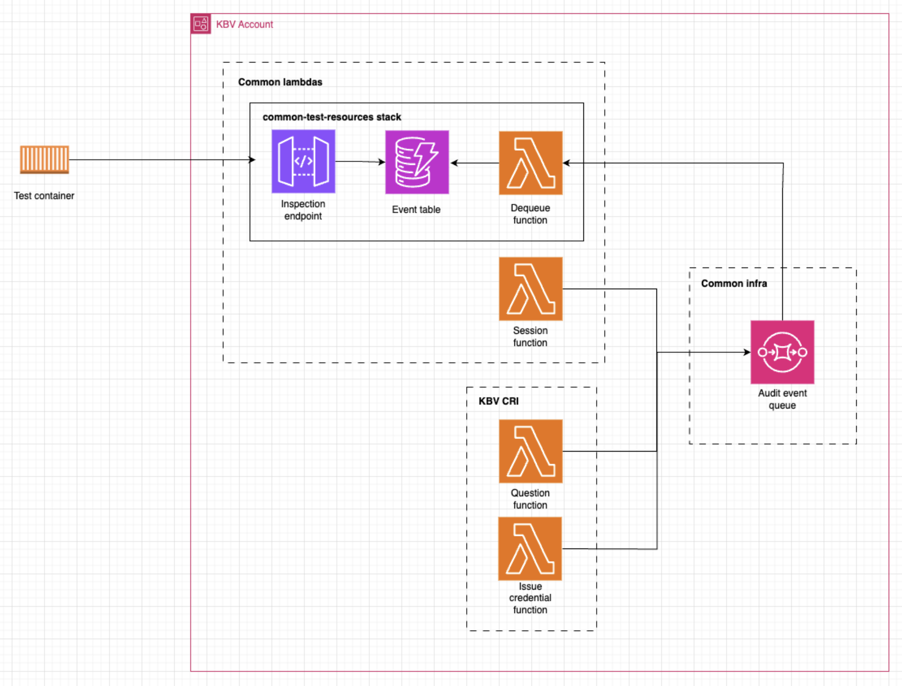

# Test Harness

This is a test harness that listens to events from the TxMA SQS queue and puts them into a test events table which can then be accessed using an API to allow automated testing of TxMA events.

The test harness is it's own stack and can be deployed to whichever accounts it's needed in by using the github action.

Please note this should only be used in dev and build environments as staging and above are integrated with TxMA. 

## How to use

1. `TxmaStackName` can be provided to tell the test harness which audit event queue it should be listening to 
2. Events added to this queue will then be put into the `audit-events-${AWS::StackName}` table. These events will exist for 1 hour
3. An inspection endpoint will be implemented to retrieve the events from the table

## Architecture

Architecture diagram in an example CRI account

